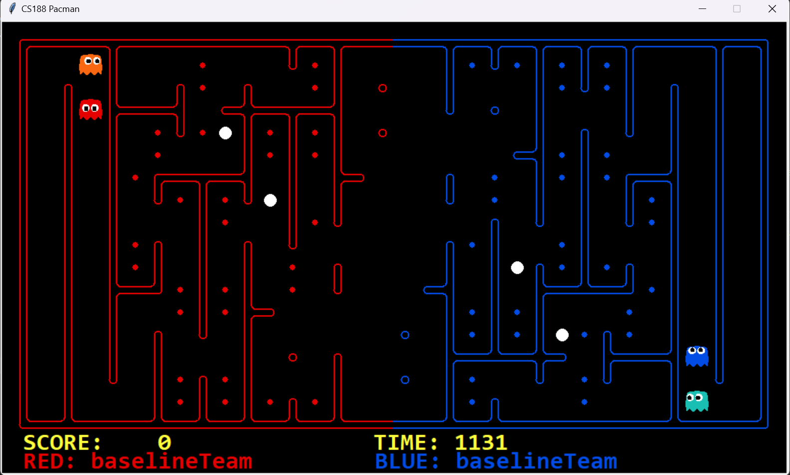
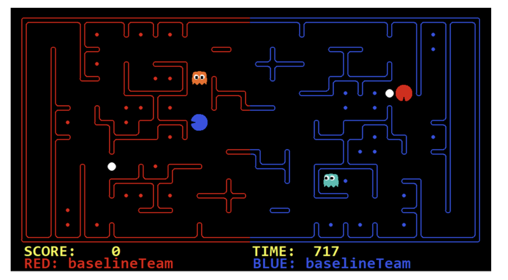

## 一.注意事项!!!
1.为了方便调试可以把capture.py中大约872行的有关'-r'和'-b'的defaut参数改成自己写的agent文件,运行文件前看看这个有没有修改回来

## 二.已解决问题
### 1.  myteam.py到底要写些什么?   
    1. 一个函数对外接口creatTeam()，感觉可以照搬myteam.py里的??
    2. 几个Agent类,这里个人认为可以组员各自写一个Agent类,选比较好的那个,或者里面的方法取更好的那个,最后汇总构成最终的Agent类
### 2. Agent类参考哪些代码?    
    1. myteam.py里的DummmyAgent类(就是个假的,个人认为没什么参考价值,不过注释有必要看下)
    2.  !!! 所有Agent类的算法原型是CaptureAgent -- 位于 captureAgents.py 文件!!!
        建议编写算法时继承 CaptureAgent 类
    3. baseline.py里的ReflexCaptureAgent类
    攻击型Agent OffensiveReflexAgent 与防御型AgentDefensiveReflexAgent
    （后两者继承的是ReflexCaptureAgent类） 
    4. 其他资料??
### 3. CaptureAgent.py中提到的factory是什么?  (6/18 22:00PM)
    应该是初始化时会调用的,没啥用
### 4. 需要写的Agent类里有一个必要的方法chooseAction(),action怎么得到 (6/18 22:00PM)
    可以参考baseline,py中的if语句部分,这一段的意思是:直到剩余可吃的豆子小于2时,选择回到起始点最短路径的action进行返回,否则返回的是能获取到豆子的最优action(这里使用方法evaluate()与max()获得的)

### 5.方法registerInitialState()的注释里所说的"使用曼哈顿距离而不是迷宫距离以节省初始化时间"是不是可以写一写?    (6/18 22:00PM)
    1.有点难度,最好不要改
    2.注释掉会影响captureagent.py中getMazeDistance()的使用

## 三.待解决问题

2. 什么是噪声距离?
3. capture.py里方法halfList(l, grid, red)中传入的l是什么?

## 四、解决方案

### 1.已知前提
1. ghost吃到能量豆之前是害怕pacman的
2. 吃到能力豆后对方40个回合都会害怕自己
3. 5个曼哈顿距离以内才能知道与对方的准确距离，否则距离是带噪声的
4. 死亡后豆子散落在死亡地点附近
5. 豆子需要带回己方区域才会得到分数
6. 每个智能体的计算时间限制为0.5s
7. 有两种胜利方式，一种是率先运回K个食物（K=N-2，为总食物数），一种是对局结束时分数更高
8. 

### 2.算法思想

1. 在初始化方法中，我们先判断地图的形状，双方交界通道小于等于2我们记作A类地图，否则记作B类地图。A类地图示例：

B类地图示例：


地图类型对防守者的决策产生影响，A类地图采用A决策，B类地图采用B决策

2. 进攻者定义3种状态，A状态（害怕状态，给定范围内出现敌方pacman），B状态（狂暴状态，吃到能量豆），C状态（空腹状态，此时给定范围内没有出现地方pacman，且没有吃到能力豆，且携带能量豆的数目少于给定值），D状态（饱腹状态，此时给定范围内没有出现地方pacman，且没有吃到能力豆，且携带能量豆的数目大于给定值）。A状态决策方式：以最快的方式远离敌方pacman，直至退出该状态；B状态决策方式：进行评估（记选择一为：n步之内吃到k个豆子w1=k/n*参数；选择二为，n步之内能迟到能量豆w2*参数，比较w1和w2大小进行决策）；C状态决策方式：寻找回家最安全，最快速的路径；D状态决策方式：计算40步之内能吃到的最多豆子数。

3. 防守者的A决策：定义3种状态，A状态（巡视状态，敌方没有进入我方领域），B状态（拦截状态，敌方进入我方领域，但是没有吃到能力豆），C状态（失守状态，敌方进入我方领域，且吃到了能量豆）。A状态的决策方式为：在两者的交界处来回移动；B状态的决策方式为：若相对于上一次豆子数目没有减少，则根据噪声距离靠近入侵者；若相对于上一次豆子数目减少了，则进行评估（根据入侵者位置和其附近的豆子数量以及能量豆的位置进行评估，算出其可能出现的位置，进行拦截）：C状态的决策方式为：防守者转变为攻击者进入敌方领域

4. 防守者B决策：定义3种状态，A状态（协助攻击状态，敌方没有进入我方领域），B状态（拦截状态，敌方进入我方领域，但是没有吃到能力豆），C状态（失守状态，敌方进入我方领域，且吃到了能量豆）。A状态的决策方式为：进入敌方领域，寻找吃到n个豆子的最短路径（n为较小值），携带豆子数等于n便返回；B状态的决策方式为：若相对于上一次豆子数目没有减少，则根据噪声距离靠近入侵者；若相对于上一次豆子数目减少了，则进行评估（根据入侵者位置和其附近的豆子数量以及能量豆的位置进行评估，算出其可能出现的位置，进行拦截）：C状态的决策方式为：防守者转变为攻击者进入敌方领域

5. 定义一个己方死亡信号，在死亡时记录死亡点，在下次复活前按最短路径先到达死亡点

6. 定义一个敌方死亡信号，在敌方死亡时，防守者进入D状态（守卫状态，优先级高于AB状态），D状态决策方式：在敌方死亡点附近移动

### 3.伪代码
```

```


