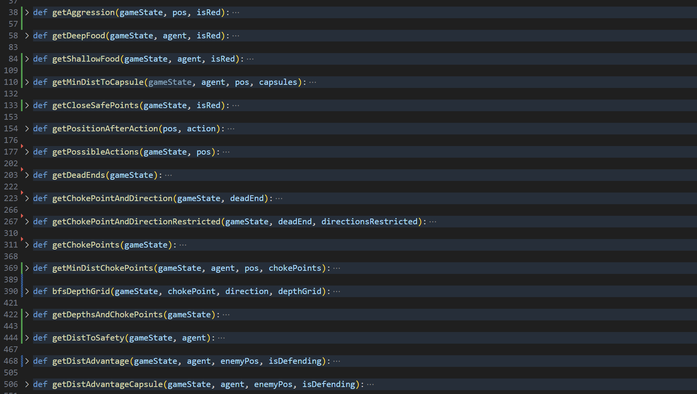
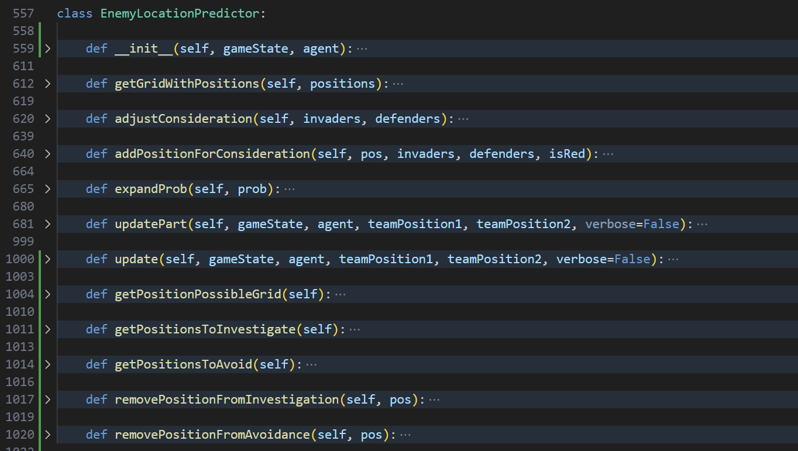
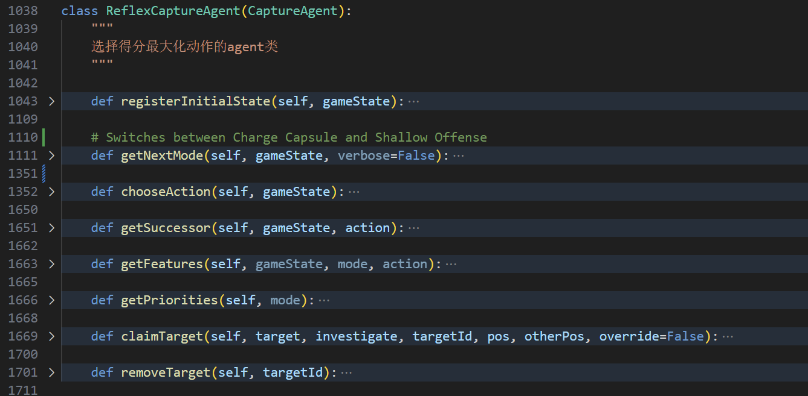

1. 编写了readme文档，确定了组员任务。
2. 更新任务，提出大致的决策算法
3. 尝试更改agent2，没有改完
4. 读了第三版本的算法，并写了大概的注释

## agent3的程序结构
1. 前面的全局函数是一些辅助函数，如图
    
    到时候我们可以抽象成一个辅助计算的类

2. `EnemyLocationPredictor`类用来预测敌人的位置
   

3. `ReflexCaptureAgent`类是一个使得分最大化的类
    

4. `OffensiveReflexAgent`类是对`ReflexCaptureAgent`类的补充，我顺手把他们合并在一起了，所以说两个agent是同一个类，不加以区分。